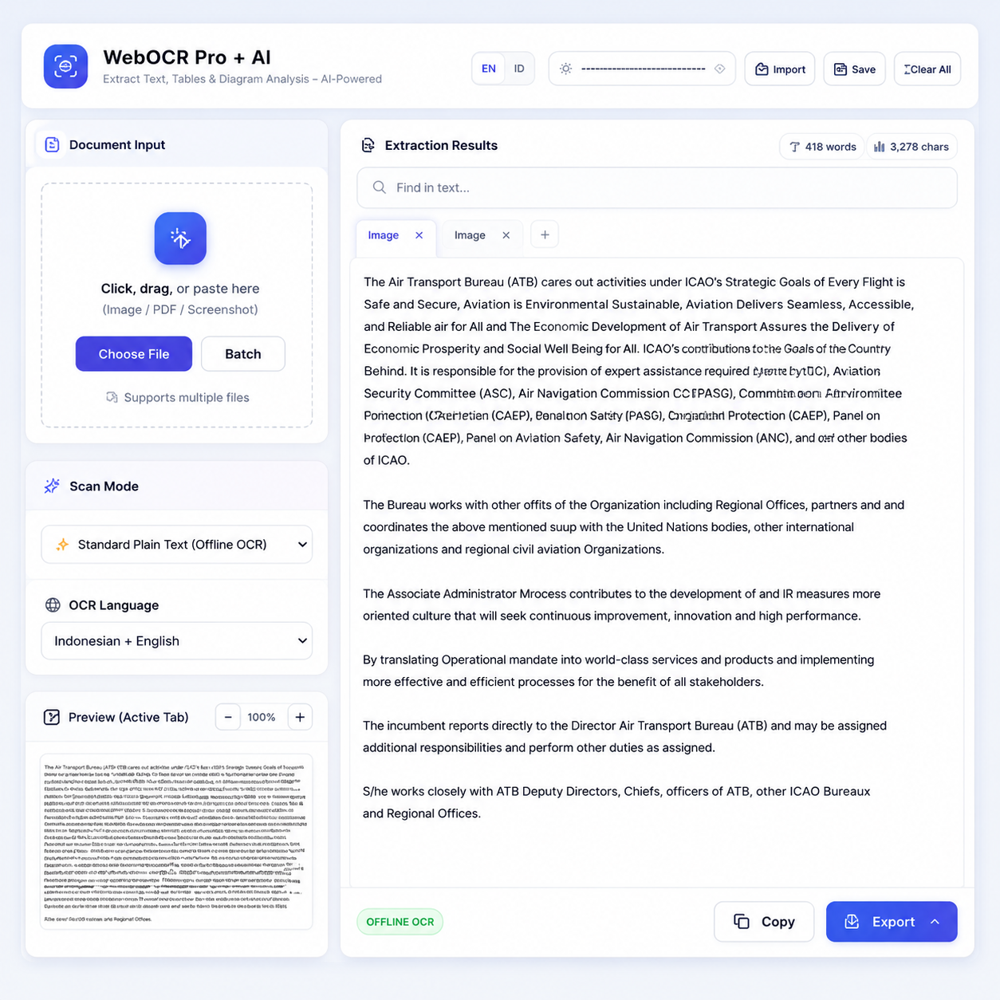

# SMART OCR AI

Offline-first OCR & AI-powered document processing tool built entirely in the browser.

Convert screenshots, images, and multi-page PDFs into editable documents with optional AI-assisted analysis.

---



## ✨ Why I Built This

Sometimes when watching videos, zooming presentations, attending meetings, or viewing protected web content, copying text directly is impossible.

The only practical option is usually taking screenshots.

After repeatedly dealing with scattered screenshots and manual copy-paste workflows, I decided to build a lightweight tool that could:

- extract text from screenshots
- combine multiple captures into one document
- process PDFs quickly
- optionally use AI for smarter analysis

All directly in the browser.

---

## 🚀 Features

### ⚡ Offline OCR (No Server Required)

- Runs locally in the browser
- Privacy-friendly
- No upload required for standard OCR mode
- Extract text from:
  - screenshots
  - images
  - scanned documents
  - PDFs

### 🧠 AI-Powered Analysis (Optional Online Mode)

Supports advanced AI processing using Gemini API:

- Smart text extraction
- Complex layout understanding
- Table extraction
- Chart & diagram analysis
- Document summarization

### 📄 Export Options

- Microsoft Word (.doc)
- TXT
- Markdown

### 📚 Batch Processing

- Combine multiple screenshots into one document
- Multi-page PDF support
- Multiple tabs workflow

### 🌐 Multi-language OCR

Supports:
- English
- Indonesian
- Chinese
- Japanese
- Korean
- French
- German
- Spanish

---

## 🖥️ Live Demo

https://anggaconni.github.io/SMART-OCR/Smart-OCR-AI.html

---

## 📸 Example Use Cases

### Research & Academia
- Convert lecture screenshots into notes
- Extract references from PDFs
- Build editable research material

### Policy & Government Work
- Process scanned documents
- Extract data from reports
- Convert screenshots into structured documentation

### Daily Productivity
- Turn screenshots into editable text
- Merge scattered references into one file
- Quickly summarize documents

### Digital Archiving
- OCR scanned archives
- Preserve legacy documents
- Create searchable text collections

---

## 🔒 Privacy First

Standard OCR mode runs entirely offline in your browser.

No server upload required.

AI mode is optional and only activated when using your own Gemini API key.

---

## 🧩 Tech Stack

- HTML5
- TailwindCSS
- Vanilla JavaScript
- Tesseract.js
- PDF.js
- Gemini API
- Marked.js
- Lucide Icons

---

## ⚙️ How It Works

### Offline OCR Flow

```text
Image / Screenshot / PDF
        ↓
Tesseract.js OCR
        ↓
Editable Text
        ↓
Export to Word / TXT / Markdown
AI Flow
Image / PDF
      ↓
Gemini AI Analysis
      ↓
Structured Output
(Tables / Summaries / Diagram Analysis)
      ↓
Export
📦 Installation
Option 1 — Use Online

Simply open:

https://anggaconni.github.io/SMART-OCR/Smart-OCR-AI.html
Option 2 — Run Locally

Clone the repository:

git clone https://github.com/yourusername/SMART-OCR.git

Open:

Smart-OCR-AI.html

No build process required.

🔑 Gemini API Setup (Optional)

AI modes require a Gemini API key.

Get one here:

https://aistudio.google.com/app/apikey

Paste the key into the app interface.

🛠️ Supported Modes
Mode	Description
Offline OCR	Standard local OCR
AI Text	Complex text & layout extraction
AI Table	Convert images into structured tables
AI Chart	Analyze charts & diagrams
AI Summary	Summarize documents
📁 Supported Formats
Input
PNG
JPG
JPEG
WEBP
PDF
Output
DOC
TXT
Markdown
🎯 Design Philosophy

SMART OCR AI focuses on:

simplicity
portability
offline-first workflows
lightweight architecture
practical real-world usage

No installation.
No backend.
No unnecessary complexity.

🔮 Future Ideas
Drag-and-drop reordering
Local AI models
OCR correction suggestions
Searchable OCR history
PWA support
Mobile optimization
Structured data extraction
Handwriting support
👨‍💻 Author

Angga Conni Saputra

Cultural heritage, digital governance, and lightweight civic-tech enthusiast focused on practical tools for real-world workflows.

📜 License

MIT License

Feel free to use, modify, and contribute.

⭐ Support

If you find this project useful:

Star the repository
Share the project
Provide feedback
Suggest features
